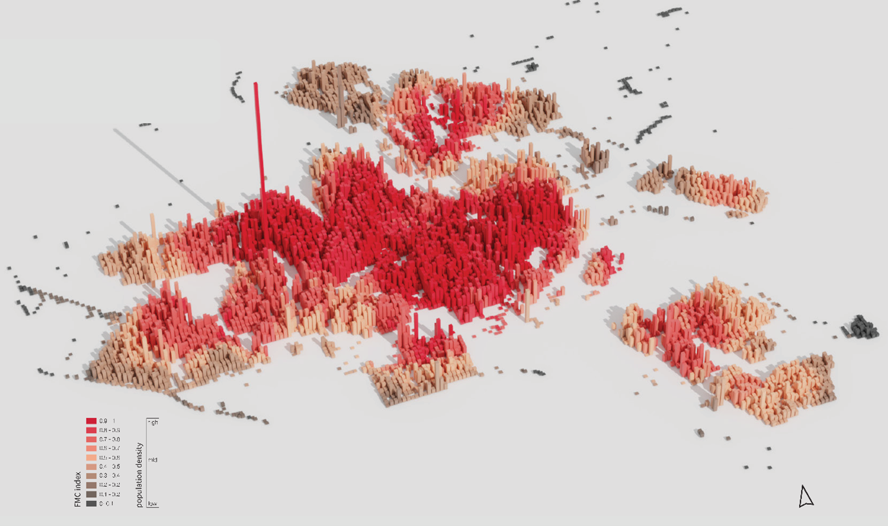

## Fine-Grained 15-Minute City Accessibility – Amsterdam

This repository contains the code and processed outputs supporting a fine-grained evaluation of the 15-Minute City in Amsterdam. The study moves beyond the “average resident” perspective and quantifies how accessibility varies across space and across socio-demographic groups.

Using high-resolution CBS population grids (100×100m and 500×500m), combined with network-based travel-time modelling, the project develops a composite 15-Minute City Accessibility Index that captures proximity to essential daily amenities and reveals spatial inequalities at the neighbourhood scale.

---
### 📦 Data

Raw datasets are hosted externally due to file size constraints.

**Zenodo DOI:** https://zenodo.org/records/18854137

### 🔎 Data sources

- **Statistics Netherlands (CBS)**
  - 100×100m population grid  
  - 500×500m population grid  
  - Population counts  
  - Age groups  
  - Migration background  
  - WOZ property value indicators  

- **OpenStreetMap**
  - Amenity locations (points and polygons)  
  - Extracted using OSMnx  

- **Municipality of Amsterdam (Open Data)**
  - Administrative boundaries  
  - Additional spatial reference layers  

### 🧠 Scripts

- `extract_amenities_osm_points_polygons.py`  
  Extracts amenities from OpenStreetMap and exports spatial layers.

- `calculate_isochrones_ors.py`  
  Computes 15-minute travel-time isochrones using OpenRouteService (ORS) and calculates grid-based accessibility indicators and composite index values.

### ▶️ Reproducibility

Install dependencies found in requirements.txt

Set your OpenRouteService API key as an environment variable.

### 📊 Outputs

The `outputs/` folder contains processed accessibility results and maps.  
Large intermediate files are not tracked.

### 🗺️ Spatial reference

- Study area: Amsterdam, The Netherlands  
- CRS: EPSG:28992 (Amersfoort / RD New)  
- Analysis year: (insert year)

### 📜 License

- OpenStreetMap data © OpenStreetMap contributors 
- CBS data subject to Statistics Netherlands terms  
- Code released under MIT license 

